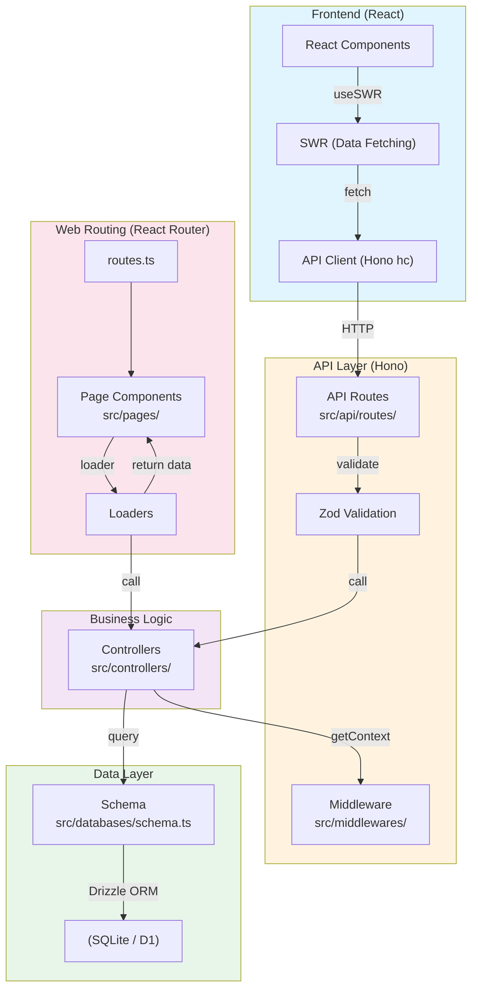

# Agent Instructions

## Overview
This is a browser-based retro gaming platform with dual-runtime architecture supporting both Node.js and Cloudflare Workers deployments.

### Tech Stack
#### Frontend
React, React Router, Radix Themes, Tailwind CSS, Iconify, SWR, i18next

#### Backend
Hono, React Router, Drizzle, Argon2 (password hashing)

#### Infrastructure
Node.js / Cloudflare Workers, SQLite / Cloudflare D1, Cloudflare R2

## Structures


**Key directories**:
- `src/databases/schema.ts` - Drizzle ORM schema
- `src/controllers/` - Business logic (e.g., `get-roms.ts`, `create-user.ts`)
- `src/api/routes/` - Hono API routes with `@hono/zod-validator`
- `src/api/client.ts` - Type-safe client using Hono's `hc<AppType>`
- `src/pages/routes.ts` - Declarative routing config
- `src/pages/routes/` - Route page entries
- `src/middlewares/` - Request context (currentUser, db)

## Setup
- Install dependencies: `pnpm i`
- Start dev server: `node --run=dev`
  By default, port `8000` will be used.

## Code Style
### General Guidelines
- Avoid redundant comments. The code should be self-explanatory.
- Keep the code concise, elegant, and composable. Follow the KISS principle and the DRY principle.
- All file names should follow lower-snake-case, except for special files like `Dockerfile`.
- Prioritize readability over performance and avoid duplication.

### JavaScript/TypeScript Guidelines
- Single quotes, no semicolons, two‑space indentation
- Use function declarations (`function xx() {}`) over function expressions (`const xx = () => {}`)
- Make use of modern features from the latest ECMAScript and the latest browsers.
- For complex data transformations, use helper functions from `es-toolkit`, while use JavaScript's built-in helpers like `for of`, `.map`, `.flatMap` for simple cases. But never use `.reduce`. There is always a better way to make it clear.
- Never use `promise.then` or `promise.catch`. We prefer `async` and `await`. If error handling becomes verbose, try using `attemptAsync` from `es-toolkit`.

### React Guidelines
- When using `useEffect`, consider whether you have to. Follow the guidelines from the article "You Might Not Need an Effect" in React's official documentation.
- Always use named exports when possible.
- One file should contain only one component. When refactoring, create new files for new components as needed.
- Use `clsx` to manipulate React `className`s when necessary. Prefer `import { clsx } from 'clsx'` over `import clsx from 'clsx'`.
- Avoid prop drilling by creating atoms in the closest `atom.ts` to the current files with Jotai. Keep the atom as close to where it's used as possible.
- Implement proper ARIA attributes for complex components.
- Use `AbortController` and `AbortSignal` for event listener cleanup instead of manual removal.
- Use `useTranslation` or `Trans` from `react-i18next` for internationalization. Pay attention to pluralization and context.

## Architecture Patterns

### Database Schema
**Base fields** (present on most tables):
- `id`: text, primary key, uses `nanoid()` for generation
- `createdAt`: integer (timestamp_ms), defaults to `new Date()`
- `updatedAt`: integer (timestamp_ms), auto-updates on write
- `status`: integer, defaults to `statusEnum.normal` (1), soft-delete uses `statusEnum.deleted` (0)

**Key tables**:
- `userTable`: username (unique), passwordHash, registrationIp, registrationUserAgent
- `sessionTable`: userId, token (unique), expiresAt, lastActivityAt, ip, userAgent
- `romTable`: userId, fileId, platform, game metadata fields
- `stateTable`: romId, core, platform, thumbnailFileId, type (auto/manual)

**Soft delete pattern**: Always filter by `eq(table.status, statusEnum.normal)` when querying active records. To delete: `update(table).set({ status: statusEnum.deleted })`

### API Client Usage
**Type-safe client** (`src/api/client.ts`):
```ts
import { client, parseResponse } from '#@/api/client.ts'

// GET request
const users = await parseResponse(client.users.$get())

// POST with form data
const result = await client.users.$post({
  form: { username, password }
})

// DELETE with params
await client.users[':id'].$delete({
  param: { id: userId }
})
```

**Error handling**: The client throws a JSON error object on non-OK responses. Use SWR's `onError` or try/catch.

### SWR Data Fetching Patterns
**Fetching data**:
```ts
import useSWR from 'swr'
import { client, parseResponse } from '#@/api/client.ts'

const { data, error, isLoading } = useSWR(
  { endpoint: 'users', method: 'get' },
  () => parseResponse(client.users.$get())
)
```

### Runtime Detection (Node.js vs Workers)
**Get runtime key**:
```ts
import { getRuntimeKey } from 'hono/adapter'
const runtimeKey = getRuntimeKey() // 'node' or 'workerd'
```

**Conditional features**:
```ts
import { getRunTimeEnv } from '#@/constants/env.ts'
const env = getRunTimeEnv()
// Cloudflare Workers has max ROM count limit, Node.js doesn't
const maxRomCount = env.RETROASSEMBLY_RUN_TIME_MAX_ROM_COUNT
```

**UI rendering**: Use `runtimeKey === 'workerd'` to conditionally render UI elements (e.g., hide account management on Workers).

### Internationalization (i18n)
**Supported languages** (12 total): en, de, es, fr, it, ja, ko, pt, ru, cs, zh-cn, zh-tw

**Adding translations**:
1. Add key to all locale files in `src/locales/`:
```ts
// src/locales/en.ts
export const translation: ResourceLanguage = {
  'My New Key': 'My New Value',
  // ...
}
```
2. Use in components:
```ts
import { useTranslation } from 'react-i18next'
const { t } = useTranslation()
<span>{t('My New Key')}</span>
```

## Common Tasks

### Adding New API Endpoints
1. Create controller in `src/controllers/my-feature.ts`:
```ts
export async function myController() {
  const c = getContext()
  const { db } = c.var
  // Business logic
  return result
}
```

2. Add route in `src/api/routes/my-feature.ts`:
```ts
import { Hono } from 'hono'
import { myController } from '#@/controllers/my-feature.ts'

export const myFeature = new Hono()

myFeature.get('/', async (c) => {
  const result = await myController()
  return c.json(result)
})
```

3. Register in `src/api/app.ts`:
```ts
import { myFeature } from './routes/my-feature.ts'

export const app = new Hono()
  .basePath('api/v1')
  .route('my-feature', myFeature)
```

4. Use in frontend via `client.myFeature.$get()`

### Adding New Routes
1. Create route file in `src/pages/routes/` (e.g., `my-feature.tsx`)
2. Add to `src/pages/routes.ts` routing config
3. Create page component in `src/pages/my-feature/`
4. Add loader if server data needed

### Adding Controllers
1. Create in `src/controllers/my-controller.ts`
2. Use `getContext().var` for dependencies
3. Export typed return values
4. Call from API routes or loaders

## Key Files for Context
- `src/constants/env.ts` - Runtime environment detection, defaults per runtime
- `src/databases/schema.ts` - Database schema, statusEnum, table structures
- `src/api/client.ts` - Type-safe API client using Hono's `hc`
- `src/api/app.ts` - Main API app, route registration
- `src/middlewares/globals.ts` - Request context setup (currentUser, db)
- `vite.config.ts` - Dual-runtime build configuration
- `react-router.config.ts` - Framework configuration
- `src/locales/en.ts` - Reference for translation keys
