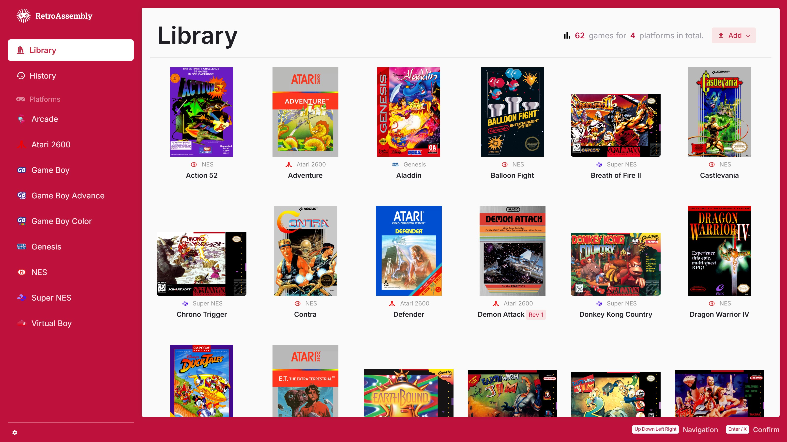

  
  <h1 align="center">RetroAssembly</h1>

  
  
  

RetroAssembly is the personal retro game collection cabinet in your browser.

## Features

- [x] Relive memories from numerous retro gaming consoles in the browser. NES, SNES, Genesis, GameBoy, Arcade... See [Supported Platforms](#supported-platforms) below.
- [x] See your game collection displayed with auto-detected beautiful box arts and covers.
- [x] Save and synchronize your game at any point and resume later.
- [x] Made a mistake? Some emulators allow you to rewind gameplay.
- [x] Browse through platforms and your game library with an intuitive interface with [spatial navigation
](https://en.wikipedia.org/wiki/Spatial_navigation), which means you can just use a keyboard or a gamepad to navigate between games.
- [x] Enhance your gaming experience with beautiful visual effects with retro-style shaders.
- [x] Play on the go, even without a physical gamepad, using our on-screen virtual controller.

---

Share your ideas to our community and they may appear here later!

<a href="https://discord.gg/gwaKRAYG6t">
  <picture>
    <source media="(prefers-color-scheme: light)" srcset="https://invidget.switchblade.xyz/gwaKRAYG6t?theme=light">
    <source media="(prefers-color-scheme: dark)" srcset="https://invidget.switchblade.xyz/gwaKRAYG6t">
    
  </picture>
</a>

## Getting Started

### Choose Your Setup
You have two options to get started with RetroAssembly:

#### Option 1: Use the Official Hosted Version
> <small>Recommended for most users. Perfect if you want to get started quickly without any setup.</small>

1. Visit [retroassembly.com](https://retroassembly.com/) in your web browser.
2. *(Optional)* If you're new here, explore the library and try out the available [demo games](https://retroassembly.com/demo) to see how it works.
3. [Login](https://retroassembly.com/login) and create your personal game library by uploading your own ROM files.
4. Once your ROMs are uploaded, select any game from your library to launch it directly in your browser and start playing.
5. Don't forget to use the in-game menu to save your progress, which will be synchronized for you.

#### Option 2: Self-Host with Docker
> <small>For advanced users who want full control. Perfect if you prefer to host your own instance, have privacy concerns, or want to customize the deployment.</small>

See [RetroAssembly's homepage on Docker Hub](https://hub.docker.com/r/arianrhodsandlot/retroassembly#quick-start).

## Supported Platforms

RetroAssembly aims to support a wide range of vintage gaming systems. Emulation is powered by [Nostalgist.js](https://nostalgist.js.org/).

  
Click here to view the full list.

  | Console | Available Emulators |
  | - | - |
  | Arcade | `fbneo`, `mame2003_plus` |
  | Atari 2600 | `stella2014` |
  | Atari 5200 | `a5200` |
  | Atari 7800 | `prosystem` |
  | Atari Lynx | `mednafen_lynx` |
  | Channel F | `freechaf` |
  | ColecoVision | `gearcoleco` |
  | Famicom Disk System | `fceumm`, `nestopia` |
  | Game & Watch | `gw` |
  | Game Boy | `mgba`, `gearboy`, `gambatte`, `tgbdual` |
  | Game Boy Advance | `mgba`, `vba_next` |
  | Game Boy Color | `mgba`, `gearboy`, `gambatte`, `tgbdual` |
  | Game Gear | `genesis_plus_gx`, `gearsystem` |
  | Genesis / Megadrive | `genesis_plus_gx` |
  | Magnavox - Odyssey2 / Philips Videopac+ | `o2em` |
  | Master System | `genesis_plus_gx`, `picodrive`, `gearsystem` |
  | Neo Geo Pocket | `mednafen_ngp` |
  | Neo Geo Pocket Color | `mednafen_ngp` |
  | NES / Family Computer | `fceumm`, `nestopia`, `quicknes` |
  | PC Engine (TurboGrafx 16) | `mednafen_pce_fast` |
  | Sega SG-1000 | `gearsystem` |
  | Super NES / Super Famicom | `snes9x`, `snes9x2002`, `snes9x2005`, `snes9x2010` |
  | Virtual Boy | `mednafen_vb` |
  | WonderSwan | `mednafen_wswan` |
  | WonderSwan Color | `mednafen_wswan` |

## Contributing
See [Contributing](docs/contributing.md).

## Open-source Alternatives
We hope you have a fantastic time revisiting your favorite retro games... Even with applications other than RetroAssembly.

- [EmulatorJS](https://emulatorjs.org) [:octocat:](https://github.com/EmulatorJS/EmulatorJS)
- [GamePlayColor](https://gameplaycolor.com) [:octocat:](https://github.com/gameplaycolor/gameplaycolor)
- [Gaseous](https://github.com/gaseous-project/gaseous-server)
- [RetroArch Web Player](https://web.libretro.com) [:octocat:](https://github.com/libretro/RetroArch/tree/master/pkg/emscripten)
- [RomM](https://romm.app/) [:octocat:](https://github.com/rommapp/romm)
- [vme](https://gitgalu.github.io/vme/) [:octocat:](https://github.com/gitGalu/vme)
- [webrcade](https://www.webrcade.com) [:octocat:](https://github.com/webrcade/webrcade)
- [webretro](https://binbashbanana.github.io/webretro/) [:octocat:](https://github.com/BinBashBanana/webretro)

## License
[MIT](license)
